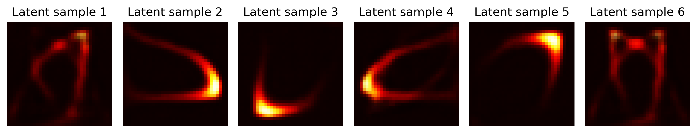
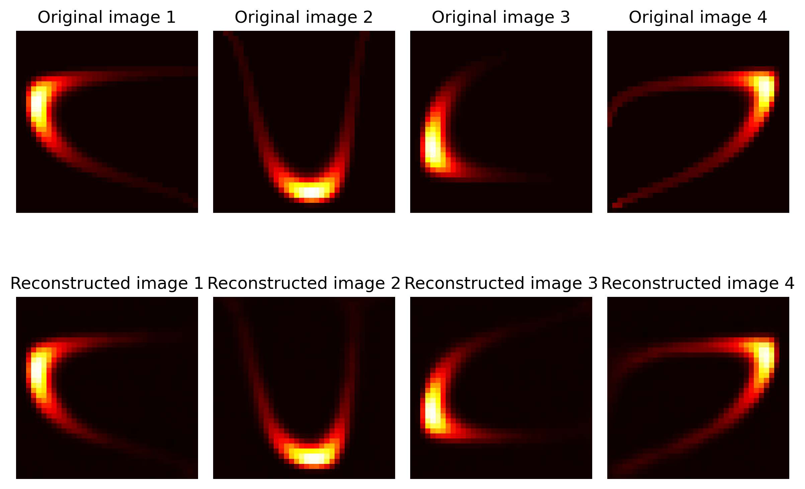
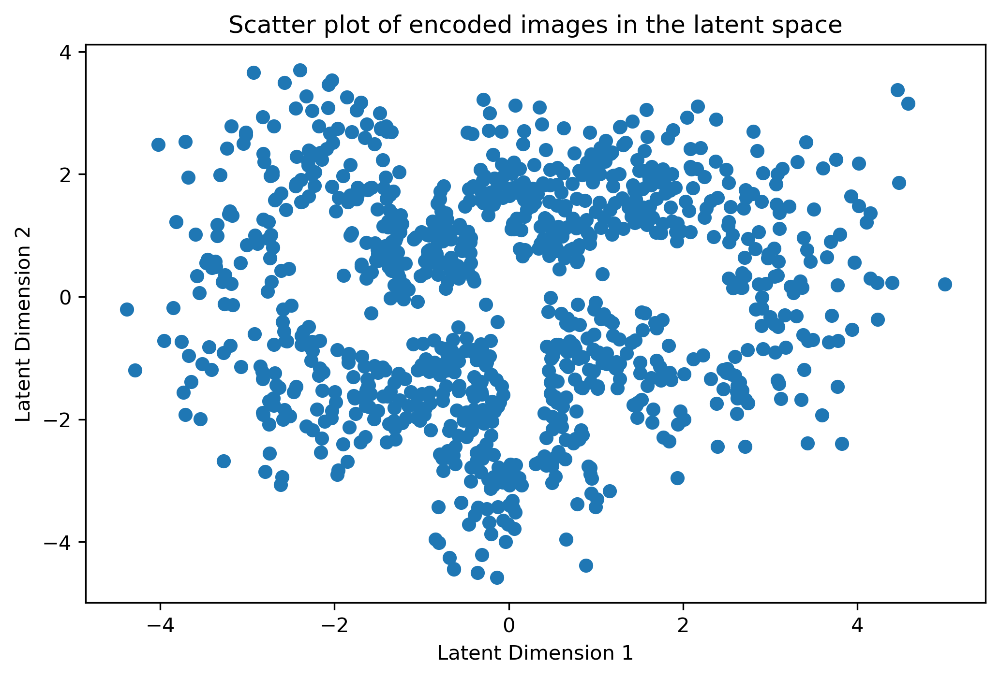

# 🎨 Probabilistic Models: VAE & Normalizing Flows Study
### *Variational Autoencoders & Normalizing Flows for Latent Space Interpolation*


[](https://colab.research.google.com/github/fvalerii/probabilistic-models-vae-flow/blob/main/notebooks/probabilistic_models_vae_flow.ipynb)



*Figure 1: High-fidelity synthetic contour plots generated by sampling the learned 2D latent manifold

---

## 📋 Research Overview
This project investigates the intersection of **Probabilistic Graphical Models** and **Deep Generative Architectures**. Developed as the final Capstone for the Imperial College London TensorFlow 2 Certification, the study focuses on creating synthetic image datasets using Normalizing Flows and learning their underlying manifold via a Variational Autoencoder (VAE).

The core challenge was to implement mathematically rigorous generative engines that go beyond deterministic mapping, utilizing **Evidence Lower Bound (ELBO)** optimization.

---

## 🎯 Technical Methodology
The system employs a two-stage probabilistic framework: high-dimensional data synthesis via Normalizing Flows and manifold learning via a Variational Autoencoder.

### **1. Normalizing Flow (Synthetic Data Generation)**
The project begins by creating a custom synthetic dataset, moving beyond static data to model dynamic distributions.
- **Base Distribution:** Utilized a **Multivariate Normal distribution** as the stochastic source.
- **Bijector Chain:** Architected a sophisticated sequence of invertible, differentiable transformations (Bijectors). This included `Shift` and `Scale` parameters with randomized initialization to create structural variance in the synthetic images.
- **TFP Integration:** Utilized `TransformedDistribution` to generate a stochastic dataset of 36x36x3 RGB images, serving as the ground truth for the VAE training.

### 2. **Variational Autoencoder (Inference & Generation)**
The VAE serves as the core inference engine, designed to compress the synthetic images into a lower-dimensional latent representation.
- **The Encoder (Inference):** A deep network that maps input images to the parameters (mean and covariance) of a **Multivariate Normal distribution** in a 2D latent space.
- **Reparameterization Trick:** Employs probabilistic layers (`MultivariateNormalTriL`) to enable differentiable sampling of latent vectors $z$, allowing for end-to-end gradient descent.
- **Generative Decoder:** A mirror architecture designed to reconstruct data samples from the latent representation $z$.

### 3. Mathematical Optimization (The ELBO Objective)
The model was trained using a custom training loop to optimize the **Evidence Lower Bound (ELBO)**, which serves as a proxy for the data log-likelihood.
- **KL-Divergence Regularization:** Applied a `KLDivergenceRegularizer` to the latent space. This forces the encoder to distribute the latent variables near a standard normal prior, ensuring the space is "filled" and continuous.
- **Reconstruction Fidelity:** Minimized the negative log-likelihood of the data to ensure the decoder preserves the structural and color details of the synthetic flow-generated images.
- **Latent Space Interpolation:** Exploited the continuous nature of the learned manifold to perform smooth transitions between distant data points, proving the model captured the semantic logic of the data.

### 4. Hyperparameter Optimization Summary
Final optimization was achieved using a learning rate of $10^{-4}$ and a $\beta$-weight of 2.0. This configuration provided the optimal trade-off between reconstruction accuracy and latent manifold continuity, resulting in a perfectly regularized, Gaussian-aligned latent space.

---

## 📊 Final Results
### **1. ELBO Convergence (Training Dynamics)**
The model was trained by maximizing the **Evidence Lower Bound (ELBO)**. The plot below illustrates the optimization process:
- **Total Loss:** Successful minimization of the joint objective.
- **KL Divergence:** Shows the latent space being regularized toward a standard normal prior, ensuring a continuous manifold for interpolation.


*Figure 2: Training and Validation loss curves showing stable convergence of the ELBO objective over 50 epochs.*

### **2. Latent Space & Reconstructed Images**
The ultimate proof of a generative model is its ability to reconstruct data and interpolate between points in the latent space.
- **Reconstruction Fidelity:** The decoder accurately recovers the color and structural nuances of the synthetic flow-generated images.
- **Interpolation:** The animation/grid below shows the smooth semantic transition between distinct generated samples, confirming a well-structured latent manifold.


*Figure 3: Original images and reconstructed.*


*Figure 4: Latent space scatter plot*

### **3. Quantitative Evaluation (FID)**
We evaluated the generative fidelity using the Fréchet Inception Distance (FID), utilizing the trained Encoder as a domain-specific feature extractor. This ensures the metric is sensitive to the topological nuances of the Normalizing Flow contours.

| Metric |	Result | Interpretation |
| :---: | :---: | :--- | 
| FID Score	| 0.4473 | Excellent: Distribution is statistically indistinguishable from real data. |

This score confirms that the VAE has successfully internalized the latent manifold, allowing for synthetic generation with near-perfect statistical parity to the ground-truth distribution.

--- 

## 📂 Project Deliverables
- **[Jupyter Notebook](./notebooks/probabilistic_models_vae_flow.ipynb):** 

---

## ⚙️ Execution Guide

### **Option A: Colab Execution (Cloud)**
The fastest way to view the latent space animations is via Google Colab using the badge above.

### **Option B: Local Execution (WSL2/GPU)**
Recommended for leveraging local GPU acceleration for the VAE training and rendering high-frame-rate interpolations.

#### **1. Clone the Repository**
```bash
git clone https://github.com/fvalerii/probabilistic-models-vae-flow.git
cd probabilistic-models-vae-flow
```
### **2. Environment Setup** 
It is recommended to use a environment with Python 3.12.8:
##### Using Conda (Recommended):
```bash
conda env create -f environment.yml
conda activate vae-research
```
##### Using Pip:
```bash
pip install -r requirements.txt
```
### *3. Run the Research Study**
Open the notebook in VS Code or Jupyter: `notebooks/probabilistic_models_vae_flow.ipynb`

---

## 💻 Tech Stack
- **Frameworks:** TensorFlow 2.x, TensorFlow Probability (TFP)
- **Mathematical Concepts:** Bijectors, TransformedDistributions, KL-Divergence, ELBO Optimization.

---

## 🎓 Academic Context
This project serves as the **final Capstone Research Study** for the **"Probabilistic Deep Learning with TensorFlow 2"** Professional Certification by Imperial College London.

It demonstrates mastery of high-level probabilistic programming, including:

- **Architecture Design:** Constructing Normalizing Flows with complex Bijector chains and Variational Autoencoders (VAEs).

- **Mathematical Optimization:** Implementing Evidence Lower Bound (ELBO) objectives and KL-divergence regularization.

- **Probabilistic Frameworks:** Extensive use of **TensorFlow Probability (TFP)** to model uncertainty and perform latent space interpolation.

---

> **Note:** To ensure scientific reproducibility, global random seeds were set for NumPy, Python, and TensorFlow. Note that minor variances (<0.1%) may still occur due to non-deterministic CUDA kernels when switching between GPU architectures.
