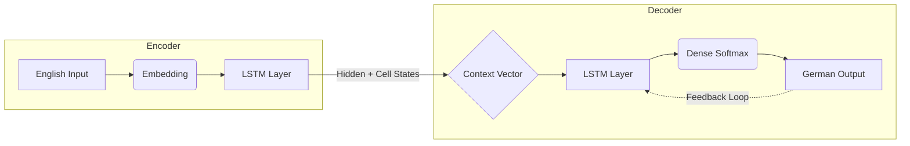

# **🌐 Neural-Translation-Seq2Seq: English-to-German Study**
### *Encoder-Decoder Architectures for Large-Scale Neural Machine Translation*

[](https://colab.research.google.com/github/fvalerii/nmt-seq2seq-translation/blob/main/notebooks/nmt_english_german_seq2seq.ipynb)


---

## **📋 Research Overview**
This project investigates the implementation of a Neural Machine Translation (NMT) system using a Sequence-to-Sequence (Seq2Seq) framework. Developed for the Imperial College London TensorFlow 2 Professional Certification, the study focuses on mapping latent semantic representations between English and German.

The project evolved from a 20,000-sample prototype into a production-ready pipeline trained on a massive corpus, achieving significant improvements in translation fluency and structural alignment.

---

## **🎯 Technical Architecture**
The system utilizes a dual-recurrent framework optimized for high-dimensional semantic mapping.

### **1. Feature Extraction & Encoding**
- **Transfer Learning:** Utilizes a pre-trained **NNLM (Neural-Net Language Model)** embedding from TensorFlow Hub to project English tokens into a 128-dimensional latent space.
- **Latent Bottleneck:** Employs a **512-unit LSTM layer** to compress the entire source sequence into a final hidden ($h$) and cell ($c$) state (the "Context Vector").
- **Orthogonal Initialization:** Used for all LSTM units to stabilize gradient flow across long sequences and prevent vanishing gradients.

### **2. Generative Decoding**
- **Vocabulary Capping:** The German vocabulary was strategically capped at 15,000 tokens to prioritize high-frequency linguistic structures and optimize GPU VRAM usage.
- **Teacher Forcing:** Utilized during training to accelerate convergence by feeding ground-truth tokens back into the recurrent engine.

### **3. Model Architecture Diagram**


*Figure: Sequence-to-Sequence framework with Latent Bottleneck and Recursive Inference.*

---

## **🚀 Large-Scale Engineering (200,000 Dataset)**
To transition from a 20,000 to a 200,000+ sample corpus, the following optimizations were critical:

- **Streaming Pipeline:** Implemented a `tf.data.Dataset` architecture with Asynchronous Prefetching (`tf.data.AUTOTUNE`) to ensure zero GPU starvation.

- **Vectorized Padding:** Dynamic truncation and padding to a fixed length of 13 ensured tensor compatibility with the Functional API.

- **Masked Loss:** Applied a custom Masked Sparse Categorical Cross-Entropy loss to ensure that padding tokens did not dilute the gradient signal.

---

## **📈 Final Performance Metrics**
Benchmark results obtained on a strictly isolated **20,000-sentence holdout set**:

| Metric | Result | Interpretation |
| :--- | :--- | :--- |
| **BLEU Score** | **17.32** | Strong baseline performance with significant n-gram overlap. |
| **Validation Perplexity** | **5.35** | High confidence in word prediction (branching factor < 6). |
| **Training Samples** | 160,000 | Robust exposure to bilingual syntax patterns. |
| **Batch Size** | 64 | Balanced gradient stability with memory efficiency. |


*Masked Sparse Categorical Crossentropy over 10 epochs. The convergence of validation loss indicates robust generalization.*

--- 

## **📂 Project Deliverables**
- **[Jupyter Notebook](./notebooks/nmt_english_german_seq2seq.ipynb):** 

---

## **⚙️ Execution Guide**
The notebook is configured for Automated Pipeline Integration. It automatically fetches the English-German corpus (provided by Imperial College) directly from Google Drive using the gdown utility. The dataset is based on the language dataset from **ManyThings.org/anki**, which consists of over 200,000 sentence pairs.

### **Option A: Colab Execution (Cloud)**
The easiest way to run the study is via Google Colab.

### **Option B: Local Execution (WSL2/GPU)**
Recommended for users with NVIDIA GPUs to leverage cuDNN acceleration.

#### **1. Clone the Repository**
```bash
git clone https://github.com/fvalerii/nmt-seq2seq-translation.git
```
### **2. Environment Setup** 
It is recommended to use a environment with Python 3.12.8:
##### Using Pip:
```bash
pip install -r requirements.txt
```
##### Using Conda:
```bash
conda env create -f environment.yml
conda activate nmt_research
```
### *3. Run the Notebook**
Open the notebook in VS Code or Jupyter: `notebooks/nmt_english_german_seq2seq.ipynb`

---

## **💻 Tech Stack**
- **Frameworks:** TensorFlow 2.x, Keras, TensorFlow Hub
- **Libraries:** NumPy, Matplotlib, NLTK (BLEU), scikit-learn
- **Execution:** Optimized for NVIDIA GPU acceleration

---

## **🎓 Academic Context**
This project serves as Capstone Research Study for the "TensorFlow 2 for Deep Learning" Professional Certification by Imperial College London. It demonstrates mastery of custom training loops, model subclassing, and complex NLP data engineering.

---

> **Note:** To ensure scientific reproducibility, global random seeds were set for NumPy, Python, and TensorFlow. Note that minor variances (<0.1%) may still occur due to non-deterministic CUDA kernels when switching between GPU architectures.
